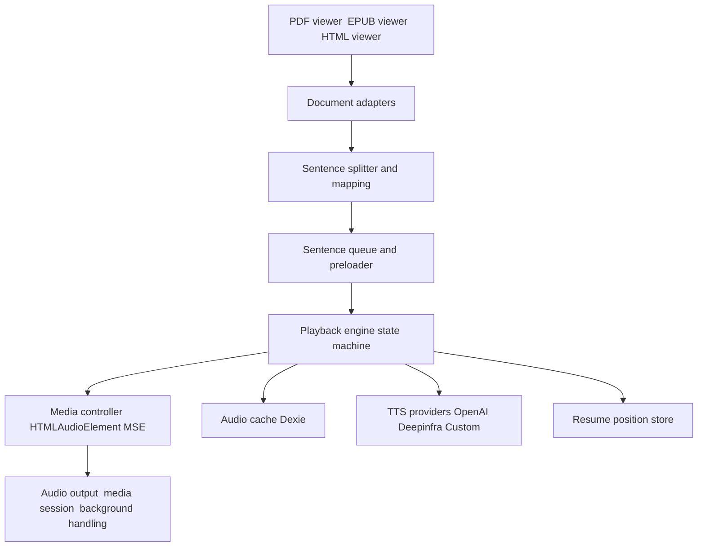

# ADR-0001 Playback architecture for v1

Status: Accepted  
Date: 2025-11-10  
Owner: @richardr1126  
Related:
- Plan checklist [docs/v1/todo.md](docs/v1/todo.md)
- Issue triage and mapping [docs/v1/issues-to-components.md](docs/v1/issues-to-components.md)

## Decision
Adopt a new, single playback engine built around HTMLAudioElement with Media Source Extensions where available, replacing Howler entirely. Introduce a provider-agnostic TTS interface and document adapters that yield stable location tokens and sentence blocks. Replace the existing IndexedDB utility with Dexie.js for persistence and caching. Ship the new engine as a clean cutover without running dual engines.

## Context
The current 0.x implementation couples TTS, viewers, and playback control in ways that create fragile flows and race conditions. Playback requires multiple edits across contexts to add features and is sensitive to timing between NLP, preloading, and Howler lifecycle. Issues highlight problems with large export downloads, dialog chunking, PDF margin extraction, and new feature support such as voice combination and chapter based exports.

Guiding constraints from v1 scope:
- Streaming first playback
- Replace Howler
- Dexie.js as client storage layer
- Preserve audiobook m4b and add chapter based MP3 export
- Keep server side document sync
- Browsers: Chrome, Firefox, Edge, Safari 16+

## Goals
- Simplify the playback pipeline with a clear state machine and strict cancellation
- Decouple document parsing from playback via adapters
- Standardize provider integration behind a unified TTS interface
- Improve resilience for long running operations and large audio artifacts
- Make preloading, skipping, voice switching predictable and race free
- Persist user state and caches using Dexie repositories

## Non goals
- Running the legacy engine in parallel with v1
- Rewriting existing viewers wholesale beyond adapter wiring and highlighting seams
- Guaranteeing true streaming for providers that only return whole file responses

## Architecture overview

## Component responsibilities

- Adapters
  - Yield text blocks plus stable locationToken
  - Handle next prev navigation semantics per format
  - Provide highlight mapping strategies
  - Files:
    - [src/v1/adapters/DocumentAdapter.ts](src/v1/adapters/DocumentAdapter.ts)
    - [src/v1/adapters/PdfAdapter.ts](src/v1/adapters/PdfAdapter.ts)
    - [src/v1/adapters/EpubAdapter.ts](src/v1/adapters/EpubAdapter.ts)
    - [src/v1/adapters/HtmlAdapter.ts](src/v1/adapters/HtmlAdapter.ts)

- NLP splitter
  - Builds sentence blocks with quote aware grouping
  - Exposes mapping to raw sentences for highlighting
  - Files:
    - [src/v1/nlp/sentences.ts](src/v1/nlp/sentences.ts)
    - Uses [src/utils/nlp.ts](src/utils/nlp.ts:1)

- Playback engine
  - Drives state transitions, cancellation, preloading, and error handling
  - Integrates with MediaController and TTS providers
  - Files:
    - [src/v1/playback/state.ts](src/v1/playback/state.ts)
    - [src/v1/playback/queue.ts](src/v1/playback/queue.ts)
    - [src/v1/playback/engine.ts](src/v1/playback/engine.ts)
    - [src/v1/playback/hooks/usePlayback.ts](src/v1/playback/hooks/usePlayback.ts)

- Media controller
  - Owns HTMLAudioElement lifecycle and Media Source Extensions when supported
  - Provides blob fallback and gapless segment chaining for Safari 16 plus
  - Integrates media session and background visibility behaviors
  - Files:
    - [src/v1/playback/media/MediaController.ts](src/v1/playback/media/MediaController.ts)
    - [src/v1/playback/media/mediaSession.ts](src/v1/playback/media/mediaSession.ts)
    - [src/v1/playback/media/background.ts](src/v1/playback/media/background.ts)

- TTS providers
  - Unified interface for synth requests and voice listing
  - Pass through custom voice strings including plus syntax when supported
  - Files:
    - [src/v1/tts/types.ts](src/v1/tts/types.ts)
    - [src/v1/tts/Provider.ts](src/v1/tts/Provider.ts)
    - [src/v1/tts/providers/OpenAIProvider.ts](src/v1/tts/providers/OpenAIProvider.ts)
    - [src/v1/tts/providers/DeepinfraProvider.ts](src/v1/tts/providers/DeepinfraProvider.ts)
    - [src/v1/tts/providers/CustomOpenAIProvider.ts](src/v1/tts/providers/CustomOpenAIProvider.ts)
    - [src/v1/tts/voices.ts](src/v1/tts/voices.ts)

- Persistence and caching
  - Dexie schema for documents, config, audio cache, positions, voices
  - Repositories expose typed APIs and transactions
  - Files:
    - [src/v1/db/schema.ts](src/v1/db/schema.ts)
    - [src/v1/db/client.ts](src/v1/db/client.ts)
    - [src/v1/db/repositories/DocumentsRepo.ts](src/v1/db/repositories/DocumentsRepo.ts)
    - [src/v1/db/repositories/ConfigRepo.ts](src/v1/db/repositories/ConfigRepo.ts)
    - [src/v1/db/repositories/AudioCacheRepo.ts](src/v1/db/repositories/AudioCacheRepo.ts)
    - [src/v1/db/repositories/VoicesRepo.ts](src/v1/db/repositories/VoicesRepo.ts)
    - [src/v1/playback/positionStore.ts](src/v1/playback/positionStore.ts)

- API surface
  - Streaming route for providers that support chunked responses
  - Range enabled audio download for large m4b artifacts
  - Files:
    - [src/app/api/tts/stream/route.ts](src/app/api/tts/stream/route.ts)
    - [src/app/api/tts/route.ts](src/app/api/tts/route.ts:1)
    - [src/app/api/tts/voices/route.ts](src/app/api/tts/voices/route.ts:1)
    - [src/app/api/audio/convert/route.ts](src/app/api/audio/convert/route.ts:1)

## Playback state machine

States
- idle
- preparing
- buffering
- playing
- paused
- stopping
- error

Transitions
- idle -> preparing on play with valid queue head
- preparing -> buffering after first audio segment request
- buffering -> playing on enough data available
- playing -> buffering when underflow or on skip voice change
- playing -> paused on user pause
- any -> stopping on stop clear queue cancel requests
- any -> error on unrecoverable error with context

Guards and effects
- All requests carry AbortController scoped to the current token
- Config changes produce a new token and cancel in flight
- Preloading is capped and respects cache budgets

## Media pipeline

- Try MSE with a SourceBuffer of audio mpeg or aac when available
- Else use short blob segments and chain playback with minimal gaps
- Apply rate changes via playbackRate for audio player speed separate from voice speed at synth time
- Integrate Media Session actions play pause next previous
- Pause on background visibility and auto resume on foreground if user was playing

## Text and highlighting

- Adapters provide raw to processed sentence mapping for highlight
- PDF adapter normalizes x positions to page width and respects left right margins
- EPUB adapter yields location tokens and section navigation
- HTML adapter passes text and uses markdown rendering only for view

## Dexie schema outline

Tables and indicative indexes
- documents id type name lastModified size dataRef
- config key value
- audioCache key createdAt expiresAt size bytesRef or chunkRefs
- positions docId locationToken sentenceIndex updatedAt
- voices provider model voices updatedAt

Exact table definitions will be codified in [src/v1/db/schema.ts](src/v1/db/schema.ts)

## API notes

- TTS stream route
  - POST returns chunked audio where provider supports it
  - Fallback to full array buffer with progressive delivery
- Audio convert route
  - Supports mp3 per chapter mode and m4b
  - Adds GET download with Accept Ranges for large files

References:
- Current TTS route [src/app/api/tts/route.ts](src/app/api/tts/route.ts:1)
- Current voices route [src/app/api/tts/voices/route.ts](src/app/api/tts/voices/route.ts:1)
- Current audio convert [src/app/api/audio/convert/route.ts](src/app/api/audio/convert/route.ts:1)

## Migration plan

- One time importer reads from legacy store helpers in [src/utils/indexedDB.ts](src/utils/indexedDB.ts:1) and writes to Dexie
- Progress UI and retryable steps
- After cutover remove legacy modules and dependencies including Howler

## Issue alignment

- #59 chapter mp3 export via chapterized pipeline and streamed zip
- #48 large m4b download via range enabled download endpoint and persistent temp artifacts
- #47 voice combination via free form voice string pass through on Deepinfra and custom
- #44 dialog chunking via quote aware grouping in splitter
- #40 pdf margins via normalized x width and better width fallback

See details in [docs/v1/issues-to-components.md](docs/v1/issues-to-components.md)

## Alternatives considered

- Keep Howler and harden with retries
  - Rejected due to continued complexity and limited streaming control
- Keep raw IndexedDB helper
  - Rejected due to ergonomics, schema evolution, and repo patterns desired
- Dual engine migration
  - Rejected to avoid complexity and surface area during refactor

## Risks and mitigations

- MSE availability and Safari variance
  - Provide blob segment fallback and small segment chaining
- Provider streaming differences
  - Design stream route with capability detection and fallbacks
- Large artifact memory pressure
  - Range enabled downloads and file backed buffers where possible
- Cache growth
  - Dexie TTL LRU and size budget enforcement with telemetry

## Rollout

- Alpha
  - HTML adapter wired end to end with engine and streaming
  - Basic Dexie schema and caches
- Beta
  - PDF and EPUB adapters with highlighting and resume
  - Chapter mp3 export
  - Migration UI
- GA
  - m4b and sync hardened
  - E2E and performance checks
  - Legacy removal

## Acceptance criteria

- Streaming start to speech under reasonable latency on cached sentences
- Voice change mid playback cancels and resumes with a single buffer rebuild
- 1 to 2 GB m4b export downloads stably in Docker with Range support
- Chapter zip exports are correct and stream without UI stalls
- Dialog is chunked appropriately without regressing non dialog cases
- PDF margins trimming is reliable across test samples

## Next actions

- Finalize checklist and sequencing in [docs/v1/todo.md](docs/v1/todo.md)
- Create v1 code skeleton and Dexie schema
- Implement engine state machine and MediaController baseline
- Wire HTML adapter and stream route for first alpha milestone