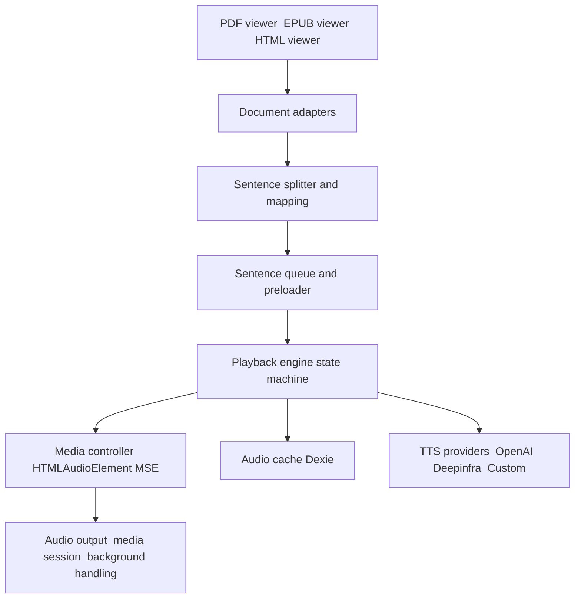

# OpenReader v1 Todo and Plan

This document captures the 1.0 rewrite plan, prioritized for a clean engine replacement and Dexie adoption. No dual engines during cutover.

See triage mapping: [docs/v1/issues-to-components.md](docs/v1/issues-to-components.md)

## Scope and guardrails
- Streaming first playback with HTMLAudioElement plus MediaSource, blob fallback
- Replace Howler across codebase
- Dexie.js for client storage, with one time migration
- Keep audiobook m4b and add chapter based MP3 export
- Keep server side document sync
- Browsers: Chrome, Firefox, Edge, Safari 16+

## Architecture overview

## Phased milestones
- 1.0.0 alpha: skeleton, Dexie, engine minimal wired to HTML viewer, streaming route
- 1.0.0 beta: PDF and EPUB adapters, highlighting, chapter MP3, migration UI
- 1.0.0: m4b stability, server sync, remove legacy, tests and a11y

## Master checklist

- [ ] Define 1.0 scope and architecture decision record in [docs/v1/ADR-0001-playback-architecture.md](docs/v1/ADR-0001-playback-architecture.md)
- [ ] Set up v1 codebase skeleton (new side by side paths): [src/v1/](src/v1/)
- [ ] Add Dexie dependency and pin version in [package.json](package.json:1)
- [ ] Implement Dexie schema and client: [src/v1/db/schema.ts](src/v1/db/schema.ts), [src/v1/db/client.ts](src/v1/db/client.ts)
- [ ] Implement repositories over Dexie: [src/v1/db/repositories/DocumentsRepo.ts](src/v1/db/repositories/DocumentsRepo.ts), [src/v1/db/repositories/ConfigRepo.ts](src/v1/db/repositories/ConfigRepo.ts), [src/v1/db/repositories/AudioCacheRepo.ts](src/v1/db/repositories/AudioCacheRepo.ts), [src/v1/db/repositories/VoicesRepo.ts](src/v1/db/repositories/VoicesRepo.ts)
- [ ] Implement 1 time migration from v0 IndexedDB to Dexie: [src/v1/migrations/migrateFromV0.ts](src/v1/migrations/migrateFromV0.ts)
- [ ] Create TTS provider interface and types: [src/v1/tts/types.ts](src/v1/tts/types.ts), [src/v1/tts/Provider.ts](src/v1/tts/Provider.ts)
- [ ] Implement providers: [src/v1/tts/providers/OpenAIProvider.ts](src/v1/tts/providers/OpenAIProvider.ts), [src/v1/tts/providers/DeepinfraProvider.ts](src/v1/tts/providers/DeepinfraProvider.ts), [src/v1/tts/providers/CustomOpenAIProvider.ts](src/v1/tts/providers/CustomOpenAIProvider.ts)
- [ ] Implement voices service unified across providers: [src/v1/tts/voices.ts](src/v1/tts/voices.ts)
- [ ] Design playback state machine no Howler: [src/v1/playback/state.ts](src/v1/playback/state.ts)
- [ ] Implement sentence queue and preloading: [src/v1/playback/queue.ts](src/v1/playback/queue.ts)
- [ ] Implement MediaController with HTMLAudioElement and MSE: [src/v1/playback/media/MediaController.ts](src/v1/playback/media/MediaController.ts)
- [ ] Implement playback engine orchestrator: [src/v1/playback/engine.ts](src/v1/playback/engine.ts)
- [ ] Implement React hook facade: [src/v1/playback/hooks/usePlayback.ts](src/v1/playback/hooks/usePlayback.ts)
- [ ] Implement unified NLP splitting wrapper: [src/v1/nlp/sentences.ts](src/v1/nlp/sentences.ts)
- [ ] Define document adapter interface and types: [src/v1/adapters/DocumentAdapter.ts](src/v1/adapters/DocumentAdapter.ts)
- [ ] Implement PDF adapter: [src/v1/adapters/PdfAdapter.ts](src/v1/adapters/PdfAdapter.ts)
- [ ] Implement EPUB adapter: [src/v1/adapters/EpubAdapter.ts](src/v1/adapters/EpubAdapter.ts)
- [ ] Implement HTML Markdown adapter: [src/v1/adapters/HtmlAdapter.ts](src/v1/adapters/HtmlAdapter.ts)
- [ ] Implement highlight strategies decoupled from viewers: [src/v1/highlight/pdfHighlighter.ts](src/v1/highlight/pdfHighlighter.ts), [src/v1/highlight/epubHighlighter.ts](src/v1/highlight/epubHighlighter.ts)
- [ ] Implement v1 contexts: [src/v1/contexts/PlaybackProvider.tsx](src/v1/contexts/PlaybackProvider.tsx), [src/v1/contexts/ConfigProviderV1.tsx](src/v1/contexts/ConfigProviderV1.tsx), [src/v1/contexts/DocumentProviderV1.tsx](src/v1/contexts/DocumentProviderV1.tsx)
- [ ] Implement v1 player components: [src/v1/components/player/Player.tsx](src/v1/components/player/Player.tsx), [src/v1/components/player/SpeedControl.tsx](src/v1/components/player/SpeedControl.tsx), [src/v1/components/player/VoicesControl.tsx](src/v1/components/player/VoicesControl.tsx), [src/v1/components/player/Navigator.tsx](src/v1/components/player/Navigator.tsx)
- [ ] Implement v1 viewers wired to adapters and playback: [src/v1/components/PDFViewerV1.tsx](src/v1/components/PDFViewerV1.tsx), [src/v1/components/EPUBViewerV1.tsx](src/v1/components/EPUBViewerV1.tsx), [src/v1/components/HTMLViewerV1.tsx](src/v1/components/HTMLViewerV1.tsx)
- [ ] Add streaming TTS API route: [src/app/api/tts/stream/route.ts](src/app/api/tts/stream/route.ts)
- [ ] Update existing TTS endpoints parity: [src/app/api/tts/route.ts](src/app/api/tts/route.ts:1), [src/app/api/tts/voices/route.ts](src/app/api/tts/voices/route.ts:1)
- [ ] Keep audiobook creation m4b: integrate providers with [src/app/api/audio/convert/route.ts](src/app/api/audio/convert/route.ts:1) and add [src/v1/playback/audiobook.ts](src/v1/playback/audiobook.ts)
- [ ] Implement chapter based MP3 export ZIP
- [ ] Implement server side document sync using Dexie repos: [src/v1/db/sync.ts](src/v1/db/sync.ts)
- [ ] Implement resume position with stable location tokens: [src/v1/playback/positionStore.ts](src/v1/playback/positionStore.ts)
- [ ] Implement robust cancellation on config changes in engine
- [ ] Implement skip blank heuristics in engine
- [ ] Implement media session integration: [src/v1/playback/media/mediaSession.ts](src/v1/playback/media/mediaSession.ts)
- [ ] Implement background visibility handling: [src/v1/playback/media/background.ts](src/v1/playback/media/background.ts)
- [ ] Safari 16 plus fallback path in MediaController
- [ ] Integrate v1 providers into app [src/app/providers.tsx](src/app/providers.tsx:1)
- [ ] Swap viewers on routes to v1: [src/app/pdf/[id]/page.tsx](src/app/pdf/[id]/page.tsx:1), [src/app/epub/[id]/page.tsx](src/app/epub/[id]/page.tsx:1), [src/app/html/[id]/page.tsx](src/app/html/[id]/page.tsx:1)
- [ ] Remove Howler usage and dependency across codebase and [package.json](package.json:12)
- [ ] Triaging GitHub issues and map to v1 components milestone 1.0
- [ ] Unit tests for playback engine transitions: [src/v1/playback/__tests__/engine.spec.ts](src/v1/playback/__tests__/engine.spec.ts)
- [ ] Unit tests for adapters sentence boundaries and tokens: [src/v1/adapters/__tests__/adapters.spec.ts](src/v1/adapters/__tests__/adapters.spec.ts)
- [ ] Integration tests streaming playback and voice switch: [tests/v1/playback.spec.ts](tests/v1/playback.spec.ts)
- [ ] Update Playwright e2e flows to v1: [tests/play.spec.ts](tests/play.spec.ts:1), [tests/upload.spec.ts](tests/upload.spec.ts:1)
- [ ] Data migration first run progress UI: [src/v1/components/Progress/MigrationProgress.tsx](src/v1/components/Progress/MigrationProgress.tsx)
- [ ] Performance checks preloading policy and cache thresholds
- [ ] Accessibility passes for v1 player and viewers
- [ ] Developer docs v1 overview [docs/v1/README.md](docs/v1/README.md) and update [README.md](README.md:10)
- [ ] Bump version to 1.0.0 in [package.json](package.json:3) and [CHANGELOG.md](CHANGELOG.md)
- [ ] Remove deprecated v0 modules after cutover: delete [src/contexts/TTSContext.tsx](src/contexts/TTSContext.tsx:1), [src/utils/indexedDB.ts](src/utils/indexedDB.ts:1), legacy audio hooks
- [ ] Release plan 1.0.0 alpha beta stable with regression gates

## Dependency ordering
- Dexie schema and repos precede engine cache features
- Engine and MediaController precede viewers
- Adapters precede highlighting and resume position
- Streaming route precedes engine integration tests

## Issue mapping alignment
- #59 Chapter MP3 export  -> audiobook.ts  stream ZIP
- #48 Large m4b download -> range enabled download  streaming response  bookId lifecycle
- #47 Voice combo plus -> allow free form voice strings and pass through for Kokoro
- #44 Dialog chunking -> quote aware grouping in splitter strategy
- #40 PDF margins -> normalize x width and add debug overlay

## Decision record outline
- Engine is single source of truth for playback
- Media controller abstracts HTMLAudioElement and MSE
- Providers are stateless except for voice lists
- Dexie stores documents configs audio cache positions

## Checkpoint gates
- Alpha: streaming route returns audio  engine plays cached sentences  HTML viewer wired
- Beta: EPUB and PDF adapters stable  highlighting  chapter MP3  migration UI
- GA: m4b and server sync robust  e2e tests green  legacy removed

## Open questions
- Do we support true streaming from all providers or progressive only for some
- Do we want optional S3 offload for very large m4b files in Docker

## Notes
- Use strict abort controller scoping on every request to avoid double requests
- Use unique cache keys text hash plus voice plus speed plus model
- Ensure token budgets by chunk length not chars only for providers with limits

---

## Expanded planning details

To make the v1 implementation predictable and fast to execute, this section adds concrete specifications (without code) for schemas, contracts, state machine events, milestones, risks, and acceptance criteria.

### Milestone breakdown and exit criteria

Alpha (focus: Dexie + Engine + HTML adapter + streaming route)
- Deliverables:
  - Dexie schema + repositories
  - Playback engine (core states and cancellation)
  - MediaController with MSE and blob fallback baseline
  - HTML viewer wired to adapters and engine
  - TTS streaming route (chunked where possible, progressive fallback)
- Acceptance:
  - Start-to-speech under 700ms on cached blocks
  - Play/Pause/Skip stable with single in-flight cancellation
  - Voice change cancels and resumes with one request wave
  - Basic resume position works for HTML

Beta (focus: PDF/EPUB adapters + highlighting + chapter MP3 + migration UI)
- Deliverables:
  - PDF adapter + highlighter; EPUB adapter + highlighter
  - Quote-aware sentence grouping toggle in splitter
  - Chapter-based MP3 export (ZIP streamed)
  - First-run migration UI (legacy to Dexie)
- Acceptance:
  - Highlight tracks current sentence reliably in PDF and EPUB
  - Chapter ZIP exports on sample EPUBs with correct file naming
  - Migration completes with progress and resumability
  - PDF margins trimming reproducible across sample PDFs

GA (focus: m4b stability + server sync + tests + removal of legacy)
- Deliverables:
  - Stable m4b creation with range-enabled download endpoint
  - Dexie-backed client sync using existing server route
  - Full test suite and a11y pass; remove legacy modules and Howler
- Acceptance:
  - Large (1–2 GB) m4b downloads complete in Docker with Range support
  - Sync round-trips documents reliably (basic CRUD and bulk)
  - E2E tests for PDF/EPUB/HTML, streaming, exports all green
  - Legacy removed and version bumped to 1.0.0

### Dexie schema (draft, no code)

Tables and primary keys:
- documents
  - id (string, pk), type (enum pdf|epub|html), name, size, lastModified, dataRef (blob pointer or chunk refs), createdAt, updatedAt
- config
  - key (string, pk), value (string), updatedAt
- audioCache
  - key (string, pk: hash of text+voice+speed+model+format), createdAt, expiresAt, size, bytesRef (blob pointer or chunk refs), provider, model, voice, speed
- positions
  - id (auto), docId (string, idx), locationToken (string), sentenceIndex (number), updatedAt
- voices
  - id (auto), provider (string, idx), model (string, idx), voices (json), updatedAt

Repository responsibilities:
- DocumentsRepo: CRUD, list, size budgeting, typed loaders for different doc types.
- ConfigRepo: get/set/clear keys, transactional updates for related keys (e.g., provider+model+savedVoices).
- AudioCacheRepo: TTL+LRU enforcement, size budgets (e.g., 100–250MB), purge policies.
- VoicesRepo: cache list per provider-model; freshness TTL.

Migration notes:
- One-time importer reads via legacy helpers in [src/utils/indexedDB.ts](src/utils/indexedDB.ts:1) and writes to Dexie with conversion of binary arrays to blobs/references.
- Idempotent: re-runs skip if target record exists with same hash.
- Progress UI surfaces counts and bytes processed.

### Playback engine state machine (events and guards)

States:
- idle, preparing, buffering, playing, paused, stopping, error

Key events:
- playRequested (with queue head present)
- pauseRequested
- stopRequested
- skipForwardRequested, skipBackwardRequested
- configChanged (voice/model/speed) -> must produce a new request token and cancel in-flight
- dataAvailable (buffer threshold met)
- underflowDetected (drop to buffering)
- errorOccurred (carry error type; decide recoverable vs terminal)

Guards:
- When configChanged, any previously created network or decode work is cancelled using an AbortController keyed by the current session token.
- Single active playback pipeline: next preloads are concurrent but bounded (e.g., N=1–2 lookahead).

Effects:
- Queue manages sentence blocks; emits prefetch intents; respects AudioCacheRepo.
- MediaController mediates HTMLAudioElement load/append and playbackRate changes (decoupled from TTS voice speed).
- PositionStore persists docId+locationToken+sentenceIndex at debounced intervals (e.g., 800–1200ms) to positions table.

### MediaController behavior (MSE-first, blob fallback)

Capabilities:
- Prefer MSE with audio/mpeg or audio/aac SourceBuffer where supported (Chrome, Edge, Firefox).
- Safari 16+ fallback path: small blob segment chaining to minimize gaps.
- PlaybackRate applies to the element (audio player speed). Voice speed remains a synth-time parameter.
- Integrate Media Session actions (play, pause, next, previous).
- Visibility changes: pause when hidden (configurable), resume on foreground if engine state is playing.

Error handling:
- MSE append errors cause a controlled transition to error or fallback to blob-segment mode, depending on browser capability checks.
- Network stalls (no chunks for T ms) trigger buffering state.

### TTS provider interface expectations (descriptive)

Responsibilities:
- Accept text block, provider, model, voice (free-form for Kokoro plus syntax), speed, and format (mp3|aac).
- Return either:
  - A stream of audio bytes (preferred), or
  - A complete audio buffer (fallback)
- Voice listing may return default sets or pass-through if API supports dynamic retrieval.

Provider notes:
- Deepinfra/Kokoro: permit plus syntax in voice; skip strict validation if “+” in string.
- Custom OpenAI-compatible: try /audio/voices endpoint for list; fallback to default.
- OpenAI: standard tts-1 or gpt-4o-mini-tts with optional instructions (for supported models).

### Streaming route contract (descriptive)

Route: POST /api/tts/stream
- Request: json body includes text, provider, model, voice, speed, response_format (mp3|aac).
- Behavior:
  - If upstream supports chunked streaming, proxy as chunked response to client.
  - Else, progressively stream the full buffer to client without buffering entire file in memory when possible.
- Headers:
  - Content-Type audio/mpeg|audio/aac
  - Prefer Transfer-Encoding chunked if supported.
- Cancellation:
  - Must respect AbortSignal to cancel upstream and downstream.

### Document adapters and location tokens

Requirements:
- Adapters yield tuples { textBlock, locationToken, rawMap } where:
  - textBlock is the processed snippet the engine will synthesize/play.
  - locationToken is a stable opaque token for resume and navigation (for PDFs: page:sentence; for EPUB: cfi-based; for HTML: line-offset or logical chunk index).
  - rawMap enables highlight alignment (processed->raw mapping).
- Navigation:
  - next/prev logic is adapter-specific (paginate for PDF, spine/section for EPUB, block index for HTML).
- PDF margins:
  - Normalize x in [0..1] by dividing by pageWidth and compare to left/right margins.
  - Compute fallback width when TextItem.width is missing; exclude header/footer using normalized y.

### Splitter strategy (dialog-aware grouping)

Behavior:
- MAX_BLOCK_LENGTH remains bounded (e.g., 300 characters target).
- Quoted dialog grouping heuristic:
  - When a sentence begins with an opening quote and the next ends with a closing quote, join unless combined length exceeds threshold; allow small overruns (e.g., +10%) to preserve dialog continuity.
- Toggle in settings to enable/disable dialog grouping; default enabled for EPUB and HTML, opt-in for PDFs.

### Exports: chapter MP3 and m4b improvements

Chapter MP3:
- Emitter builds per-chapter tasks using EPUB table of contents mapping; fallback to “Unknown Section - N” when absent.
- ZIP stream response for many files; return progressively to client; ensure Content-Disposition triggers download reliably.

m4b improvements:
- Post-processing retains bookId and serves artifact via a dedicated GET endpoint that supports Accept-Ranges.
- UI downloads via streamed response, not loading entire buffer in memory.
- Clean-up policy configurable (e.g., keep artifacts for X hours/days).

### Server-side sync plan (client-driven)

Client sync service uses repositories to:
- Read all documents and upload in batches to [src/app/api/documents/route.ts](src/app/api/documents/route.ts:1).
- Download and write back to Dexie (convert numeric arrays to ArrayBuffer/Blob).
- Provide progress events to UI with percentage and status text.

### Testing matrix and acceptance

Unit (engine and adapters):
- Engine: transitions, cancellation on config change, underflow to buffering, single resume path.
- Adapters: PDF margin trimming, EPUB section mapping, HTML block indexing, dialog grouping on/off.

Integration:
- Streaming playback path: start-to-speech latency, skip forward/back, voice switch.
- Chapter MP3 export on sample EPUB: counts and filenames match TOC.
- m4b large export streaming with Range download in Docker; verify file size and integrity.

E2E:
- Upload and open PDF/EPUB/HTML; play with highlight; persist/resume position.
- Settings changes (provider/model/voice/speeds) do not cause double requests or deadlocks.

### Risks and mitigations

- Provider streaming variability:
  - Route capability detection and fallback; progressive responses when chunked not possible.
- Safari inconsistencies:
  - Proactive blob-fallback and small segment chaining; limit segment durations to reduce gaps.
- Cache growth and quota:
  - Dexie TTL/size budgets; purge on startup and opportunistically; surface approximate disk usage to users in settings.
- Large artifacts:
  - Range-enabled endpoints; avoid buffering full files in memory.

### Work sequencing (implementation order)

1) Dexie foundation
- Schema + client + repositories
- One-time migration script and Progress UI

2) Engine baseline
- State, queue, cancellation, MediaController baseline
- HTML adapter and streaming route
- Hook facade for React

3) PDF/EPUB adapters + highlighting
- PDF first, then EPUB (navigation and CFI)
- Splitter dialog-aware grouping + toggle

4) Exports and downloads
- Chapter MP3 (ZIP), m4b GET download with Range

5) Sync + polish
- Client sync service
- A11y, performance, tests, legacy removal, version bump

### Acceptance gates (per milestone)

- Alpha gate:
  - Play cached text in HTML with streaming route; skip/voice switch stable
- Beta gate:
  - PDF and EPUB highlight track sentences; chapter export functional; migration works reliably
- GA gate:
  - m4b Range download stable for large files; server sync; E2E suite green; legacy removed; version bumped

---

## Scaffold and naming (authoritative file list)

The following v1 files will be created verbatim to avoid dual-engine complexity. Each path is the single source of truth for its concern.

Playback and media
- [src/v1/playback/state.ts](src/v1/playback/state.ts)
- [src/v1/playback/queue.ts](src/v1/playback/queue.ts)
- [src/v1/playback/engine.ts](src/v1/playback/engine.ts)
- [src/v1/playback/hooks/usePlayback.ts](src/v1/playback/hooks/usePlayback.ts)
- [src/v1/playback/media/MediaController.ts](src/v1/playback/media/MediaController.ts)
- [src/v1/playback/media/mediaSession.ts](src/v1/playback/media/mediaSession.ts)
- [src/v1/playback/media/background.ts](src/v1/playback/media/background.ts)
- [src/v1/playback/positionStore.ts](src/v1/playback/positionStore.ts)
- [src/v1/playback/audiobook.ts](src/v1/playback/audiobook.ts)

TTS providers
- [src/v1/tts/types.ts](src/v1/tts/types.ts)
- [src/v1/tts/Provider.ts](src/v1/tts/Provider.ts)
- [src/v1/tts/providers/OpenAIProvider.ts](src/v1/tts/providers/OpenAIProvider.ts)
- [src/v1/tts/providers/DeepinfraProvider.ts](src/v1/tts/providers/DeepinfraProvider.ts)
- [src/v1/tts/providers/CustomOpenAIProvider.ts](src/v1/tts/providers/CustomOpenAIProvider.ts)
- [src/v1/tts/voices.ts](src/v1/tts/voices.ts)

Adapters and highlighting
- [src/v1/adapters/DocumentAdapter.ts](src/v1/adapters/DocumentAdapter.ts)
- [src/v1/adapters/PdfAdapter.ts](src/v1/adapters/PdfAdapter.ts)
- [src/v1/adapters/EpubAdapter.ts](src/v1/adapters/EpubAdapter.ts)
- [src/v1/adapters/HtmlAdapter.ts](src/v1/adapters/HtmlAdapter.ts)
- [src/v1/highlight/pdfHighlighter.ts](src/v1/highlight/pdfHighlighter.ts)
- [src/v1/highlight/epubHighlighter.ts](src/v1/highlight/epubHighlighter.ts)

NLP
- [src/v1/nlp/sentences.ts](src/v1/nlp/sentences.ts)

Dexie database
- [src/v1/db/schema.ts](src/v1/db/schema.ts)
- [src/v1/db/client.ts](src/v1/db/client.ts)
- [src/v1/db/repositories/DocumentsRepo.ts](src/v1/db/repositories/DocumentsRepo.ts)
- [src/v1/db/repositories/ConfigRepo.ts](src/v1/db/repositories/ConfigRepo.ts)
- [src/v1/db/repositories/AudioCacheRepo.ts](src/v1/db/repositories/AudioCacheRepo.ts)
- [src/v1/db/repositories/VoicesRepo.ts](src/v1/db/repositories/VoicesRepo.ts)
- [src/v1/db/sync.ts](src/v1/db/sync.ts)
- [src/v1/migrations/migrateFromV0.ts](src/v1/migrations/migrateFromV0.ts)

React contexts and components
- [src/v1/contexts/PlaybackProvider.tsx](src/v1/contexts/PlaybackProvider.tsx)
- [src/v1/contexts/ConfigProviderV1.tsx](src/v1/contexts/ConfigProviderV1.tsx)
- [src/v1/contexts/DocumentProviderV1.tsx](src/v1/contexts/DocumentProviderV1.tsx)
- [src/v1/components/player/Player.tsx](src/v1/components/player/Player.tsx)
- [src/v1/components/player/SpeedControl.tsx](src/v1/components/player/SpeedControl.tsx)
- [src/v1/components/player/VoicesControl.tsx](src/v1/components/player/VoicesControl.tsx)
- [src/v1/components/player/Navigator.tsx](src/v1/components/player/Navigator.tsx)
- [src/v1/components/PDFViewerV1.tsx](src/v1/components/PDFViewerV1.tsx)
- [src/v1/components/EPUBViewerV1.tsx](src/v1/components/EPUBViewerV1.tsx)
- [src/v1/components/HTMLViewerV1.tsx](src/v1/components/HTMLViewerV1.tsx)
- [src/v1/components/Progress/MigrationProgress.tsx](src/v1/components/Progress/MigrationProgress.tsx)

API routes
- [src/app/api/tts/stream/route.ts](src/app/api/tts/stream/route.ts)
- [src/app/api/tts/route.ts](src/app/api/tts/route.ts:1)
- [src/app/api/tts/voices/route.ts](src/app/api/tts/voices/route.ts:1)
- [src/app/api/audio/convert/route.ts](src/app/api/audio/convert/route.ts:1)

Tests
- [src/v1/playback/__tests__/engine.spec.ts](src/v1/playback/__tests__/engine.spec.ts)
- [src/v1/adapters/__tests__/adapters.spec.ts](src/v1/adapters/__tests__/adapters.spec.ts)
- [tests/v1/playback.spec.ts](tests/v1/playback.spec.ts)

## Sequenced next actions (implementation-ready)

1) Documentation and dependencies
- [ ] Pin Dexie dependency in [package.json](package.json:1); plan minimal types footprint
- [ ] Lock ADR baseline: [docs/v1/ADR-0001-playback-architecture.md](docs/v1/ADR-0001-playback-architecture.md)

2) Dexie foundation
- [ ] Author schema tables in [src/v1/db/schema.ts](src/v1/db/schema.ts)
- [ ] Implement [src/v1/db/client.ts](src/v1/db/client.ts) with versioning and migrations
- [ ] Build repositories (Documents, Config, AudioCache, Voices)

3) Migration and UI
- [ ] Implement [src/v1/migrations/migrateFromV0.ts](src/v1/migrations/migrateFromV0.ts) reading [src/utils/indexedDB.ts](src/utils/indexedDB.ts:1)
- [ ] Wire [src/v1/components/Progress/MigrationProgress.tsx](src/v1/components/Progress/MigrationProgress.tsx) into a first-run flow

4) Playback engine baseline
- [ ] Implement [src/v1/playback/state.ts](src/v1/playback/state.ts) states and events
- [ ] Implement [src/v1/playback/queue.ts](src/v1/playback/queue.ts) with lookahead and cache keys
- [ ] Implement [src/v1/playback/media/MediaController.ts](src/v1/playback/media/MediaController.ts) with MSE first, blob fallback
- [ ] Implement [src/v1/playback/engine.ts](src/v1/playback/engine.ts) with strict AbortController scoping
- [ ] React facade in [src/v1/playback/hooks/usePlayback.ts](src/v1/playback/hooks/usePlayback.ts)

5) HTML path to first audio
- [ ] Implement [src/v1/adapters/HtmlAdapter.ts](src/v1/adapters/HtmlAdapter.ts)
- [ ] Implement [src/app/api/tts/stream/route.ts](src/app/api/tts/stream/route.ts) (chunked and progressive fallback)
- [ ] Minimal [src/v1/components/HTMLViewerV1.tsx](src/v1/components/HTMLViewerV1.tsx) + [src/v1/components/player/Player.tsx](src/v1/components/player/Player.tsx) to validate streaming

6) PDF and EPUB adapters
- [ ] Implement [src/v1/adapters/PdfAdapter.ts](src/v1/adapters/PdfAdapter.ts) with normalized margins and debug toggles, and [src/v1/highlight/pdfHighlighter.ts](src/v1/highlight/pdfHighlighter.ts)
- [ ] Implement [src/v1/adapters/EpubAdapter.ts](src/v1/adapters/EpubAdapter.ts) and [src/v1/highlight/epubHighlighter.ts](src/v1/highlight/epubHighlighter.ts)

7) NLP dialog grouping
- [ ] Wrap splitter in [src/v1/nlp/sentences.ts](src/v1/nlp/sentences.ts) and honor a quote-aware grouping flag

8) Exports
- [ ] Add chapter MP3 ZIP path via [src/v1/playback/audiobook.ts](src/v1/playback/audiobook.ts)
- [ ] Harden m4b downloads using Range in [src/app/api/audio/convert/route.ts](src/app/api/audio/convert/route.ts:1)

9) Sync
- [ ] Implement [src/v1/db/sync.ts](src/v1/db/sync.ts) client-driven sync flow

10) Switch-over and removal
- [ ] Replace providers in [src/app/providers.tsx](src/app/providers.tsx:1) to v1
- [ ] Swap viewers on routes to v1
- [ ] Remove Howler dependency in [package.json](package.json:12) after cutover
- [ ] Delete legacy modules [src/contexts/TTSContext.tsx](src/contexts/TTSContext.tsx:1), [src/utils/indexedDB.ts](src/utils/indexedDB.ts:1)

## Acceptance tests to author (explicit)

Playback engine
- [ ] Single inflight: issuing toggle or voice change cancels prior token and yields exactly one fresh request wave
- [ ] Underflow causes buffering and recovers on next data
- [ ] Background/foreground preserves intended state

Streaming route
- [ ] Chunked path sends Content-Type audio/mpeg|aac; progressive fallback functions when chunking is not supported
- [ ] Client AbortSignal cancels upstream

Adapters and highlight
- [ ] PDF: left/right margins trim deterministically across sample PDFs; highlight aligns with playing sentence
- [ ] EPUB: section navigation next/prev works; highlight aligns; resume from location token
- [ ] HTML: block indexing stable and resume works

NLP grouping
- [ ] Dialog passages grouped unless size exceeds threshold; toggle off reverts to baseline splitting

Exports
- [ ] Chapter MP3 ZIP produces files named NN - Chapter Title.mp3; ZIP streams without buffering entire archive
- [ ] m4b Range download stable for 1–2 GB files under Docker

Sync and migration
- [ ] First-run migration completes with retriable steps and progress
- [ ] Sync uploads/downloads all docs with correct counts and bytes

## Risks checklist and mitigations

- [ ] Provider streaming variability -> route capability checks and progressive response fallback
- [ ] Safari MSE variance -> short blob segment chaining; segment duration caps
- [ ] Cache quota pressure -> Dexie TTL/LRU budgets and purge on startup
- [ ] Large artifact memory -> Range endpoints; avoid in-memory buffers; disk-backed streams
- [ ] Race conditions -> session tokens and abort scoping for network and decode paths

## Notes on versioning and flags

- [ ] Feature flags: dialog grouping default on for EPUB/HTML, off for PDF
- [ ] Schema version pin in [src/v1/db/client.ts](src/v1/db/client.ts) with explicit upgrade function
- [ ] Saved voices map by provider:model in ConfigRepo

## Done criteria for 1.0.0

- [ ] Legacy engine removed; all routes/viewers wired to v1
- [ ] Exports (m4b and chapter MP3) robust under Docker and local
- [ ] E2E tests cover PDF/EPUB/HTML reading, streaming playback, skip, voice switch, resume, exports
- [ ] Docs updated: [docs/v1/README.md](docs/v1/README.md), [README.md](README.md:10), changelog updated and version bumped in [package.json](package.json:3)

---

## Capability matrix and detection

Provider streaming capability (planned handling)
- OpenAI (audio.speech): treat as progressively readable stream from the Response body; prefer chunked transfer in [src/app/api/tts/stream/route.ts](src/app/api/tts/stream/route.ts)
- Deepinfra: prefer progressive streaming when supported; fallback to full buffer proxy
- Custom OpenAI-compatible: probe endpoint with a tiny synth call in a capability check, then cache provider features in [src/v1/tts/voices.ts](src/v1/tts/voices.ts) or [src/v1/tts/Provider.ts](src/v1/tts/Provider.ts)

Browser feature checks (performed once per session)
- MSE availability and supported MIME types for audio/mpeg and audio/aac; cache in memory in [src/v1/playback/media/MediaController.ts](src/v1/playback/media/MediaController.ts)
- Visibility API handling (document.hidden) and Media Session handlers: integrated in [src/v1/playback/media/background.ts](src/v1/playback/media/background.ts) and [src/v1/playback/media/mediaSession.ts](src/v1/playback/media/mediaSession.ts)

Decision rules
- If MSE and provider stream: MSE pipeline
- If MSE but provider returns full buffer only: still MSE if chunking the buffer is practical; else blob fallback
- If no MSE: blob fallback with small segments to minimize gaps

## Migration plan (step-by-step)

Pre-migration checks
- Detect legacy stores via [src/utils/indexedDB.ts](src/utils/indexedDB.ts:1)
- Estimate total bytes and number of documents; show plan to user

Execution steps (idempotent)
1) Create Dexie stores in [src/v1/db/client.ts](src/v1/db/client.ts)
2) Copy documents from legacy to Dexie in batches; convert numeric arrays to ArrayBuffer/Blob
3) Copy config items; normalize provider, model, baseUrl; write to [src/v1/db/repositories/ConfigRepo.ts](src/v1/db/repositories/ConfigRepo.ts)
4) Copy last-location metadata into [src/v1/playback/positionStore.ts](src/v1/playback/positionStore.ts)
5) Report progress and allow retry on failure (resume from last completed batch)

Post-migration
- Mark legacy as migrated (config flag) to avoid future runs
- Option to purge legacy data (explicit user action)

UI
- Show a first-run guided modal in [src/v1/components/Progress/MigrationProgress.tsx](src/v1/components/Progress/MigrationProgress.tsx) with percentage and current step

## Chapter MP3 export plan

Source of chapter boundaries
- EPUB: TOC mapping in adapter; chapter per TOC item, merge small sections to avoid micro-chapters
- PDF: future enhancement (out of initial scope unless PDF outlines/TOC present)

Export path
- Build per-chapter audio buffers using providers via the same synth path as playback (no separate engine)
- Stream a ZIP response with ZIP64 support for large aggregate sizes through [src/app/api/audio/convert/route.ts](src/app/api/audio/convert/route.ts:1) with a mode switch
- Names: NN - Chapter Title.mp3 with zero-padded NN
- Progress events (client-side): show current chapter index, bytes accumulated

Acceptance criteria
- A 50+ chapter EPUB exports as a streamed ZIP without UI stalls or memory spikes
- ZIP integrity verified by unzip on client

## Large m4b export stability (range-enabled)

Server
- Add GET download path on [src/app/api/audio/convert/route.ts](src/app/api/audio/convert/route.ts:1) to stream artifacts from disk via Accept-Ranges with 206 responses
- Keep temp artifacts by bookId; implement cleanup policy (e.g., TTL-based) and a management UI later

Client
- Perform HTTP range-enabled download; avoid buffering into memory; use streams to file via browser download APIs

Acceptance criteria
- 1–2 GB m4b downloads complete in Docker with stable throughput; resume on flaky connections is acceptable via range retries

## Highlight alignment and sentence mapping

PDF
- Normalize x to [0..1]; apply left/right margins strictly
- When width is missing, estimate from glyph metrics; exclude header/footer using normalized y
- Highlighter replays processed-to-raw mapping from adapter map in [src/v1/highlight/pdfHighlighter.ts](src/v1/highlight/pdfHighlighter.ts)

EPUB
- Use adapter-provided raw mapping and section context to highlight current text span in [src/v1/highlight/epubHighlighter.ts](src/v1/highlight/epubHighlighter.ts)

HTML
- Use block index mapping; highlighting simpler (no layout transforms)

## Performance and budgets

Audio cache (Dexie)
- Budget target: 100–250 MB, configurable
- Eviction: TTL and LRU; purge on startup and opportunistically when budgets exceeded
- Keys: hash(text + provider + model + voice + speed + format)

Queue and prefetch
- Lookahead of 1–2 blocks, adaptive to latency
- Abort prefetch on config change or navigation

Target latencies
- Cached block start-to-speech &lt; 500–700 ms
- Non-cached with stream: first audible audio chunk &lt; 1.5–2.5 s (provider-dependent)

## Accessibility checklist

Player
- Buttons keyboard accessible, ARIA labels, focus ring
- Space/Enter to toggle play/pause; left/right to skip; up/down for speed adjustments

Viewers
- Highlight announced via ARIA-live optional verbosity setting
- Navigator provides input with label and validation errors announced

## Work package owners (placeholders)

- Dexie schema and repos: assign to Core
- Engine and MediaController: assign to Core
- HTML adapter path to first audio: assign to Core
- PDF adapter + highlighting: assign to PDF
- EPUB adapter + highlighting: assign to EPUB
- Chapter MP3 export and m4b Range path: assign to Audio
- Migration UI: assign to UI
- Tests (unit, integration, e2e): assign to QA

## Timeline (tentative, after approval)

- Week 1–2: Dexie + Engine baseline + HTML path + stream route (Alpha)
- Week 3–4: PDF + EPUB adapters + highlighting + dialog grouping + migration UI (Beta)
- Week 5–6: Chapter MP3 + m4b Range + sync + tests + a11y + legacy removal (GA)

## Open questions (to resolve before coding)

- Exact provider streaming capabilities to lock in API adapter behavior in [src/app/api/tts/stream/route.ts](src/app/api/tts/stream/route.ts)
- Target audio formats default (mp3 vs aac) per provider for best MSE compatibility
- Chapter detection for PDFs: scope to outlines only in v1.0 or defer to 1.1

## Planning links

- Issue mapping: [docs/v1/issues-to-components.md](docs/v1/issues-to-components.md)
- Architecture decision: [docs/v1/ADR-0001-playback-architecture.md](docs/v1/ADR-0001-playback-architecture.md)
- Implementation scaffold list above mirrors the master checklist paths
